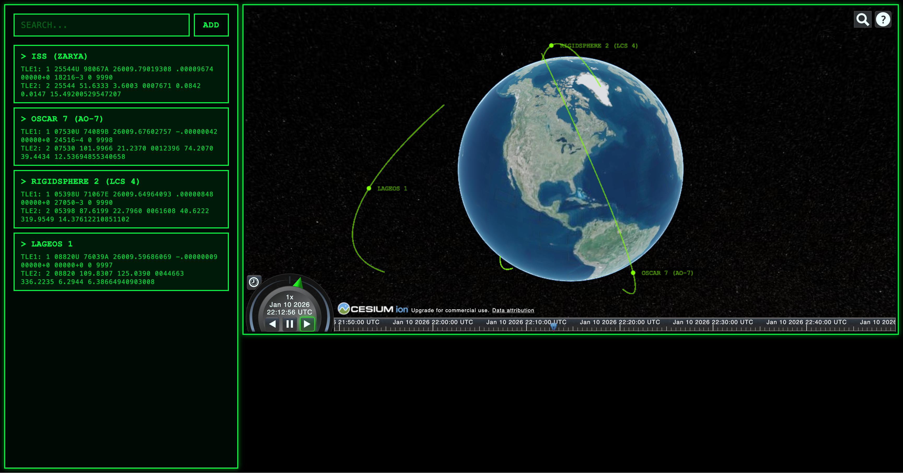

# Satellite Tracker



## Table of Contents

- [About](#about)
- [Features](#features)
- [Installation](#installation)
  - [Client Setup](#client-setup)
  - [Backend (Python) Setup](#backend-python-setup)
- [Usage](#usage)
- [Configuration](#configuration)
- [Contributing](#contributing)
- [License](#license)
- [Resources](#resources)

---

## About

**Satellite Tracker** is a dashboard for tracking satellites, featuring a Telegram bot for notifications and a Cesium-powered globe for real-time satellite rendering. Originally started as an ISS tracker tutorial, it now supports multiple satellites, user data management, and push notifications.


## API

- **Cloud Cover Data:**
  - Satellite visibility calculations use real-time cloud cover data from the [Open-Meteo API](https://open-meteo.com/), a free and open weather API. This allows the backend to consider local cloudiness when determining if a satellite is visible to the user. The implementation is modular and can be swapped for other providers if needed.

## Features


- Real-time satellite tracking on a 3D globe (Cesium)
- Telegram bot notifications when satellites are near
- Backend API for user and satellite data
- Modular architecture (client, server, bot)

## Roadmap

- [x] **Repository Structure & Setup**
  - [x] Create `apps/` directory for modular structure
  - [x] Add per-app requirements.txt for Python dependencies
  - [x] Add .env.example files for all apps
  - [x] Add Dockerfile and docker-compose for backend

- [x] **Backend API**
  - [x] Set up FastAPI server
  - [x] Implement user and satellite models
  - [x] Create endpoints for user and satellite management
  - [x] Integrate database (PostgreSQL via SQLAlchemy)
  - [ ] Add authentication & user management improvements
  - [ ] Add API tests
  - [ ] Refactor users table for multi-deployment support

- [x] **Satellite Calculation Logic**
  - [x] Implement TLE parsing and satellite position calculation (Skyfield, sgp4)
  - [x] Expose calculation logic via API

- [x] **Client (React + Cesium)**
  - [x] Migrate from vanilla JS to React
  - [x] Integrate Cesium globe for satellite visualization
  - [x] Display satellites on globe
  - [x] Support tracking of any number of satellites (>=1)
  - [ ] Add estimation of when satellite passes over user location next time
  - [ ] Improve UI/UX for satellite management

- [x] **Telegram Bot**
  - [x] Set up bot with aiogram
  - [x] Implement user registration via location sharing
  - [x] Integrate with backend API for user/satellite data
  - [ ] Send push notifications when satellite is near user
  - [ ] Add more user commands and help

- [ ] **Integration & Dashboard**
  - [x] Combine client, backend, and bot into a unified dashboard app
  - [ ] Add admin/monitoring features

- [ ] **Testing & Quality**
  - [ ] Set up linting for Python and TypeScript
  - [ ] Add CI/CD pipeline (GitHub Actions?)
  - [ ] Add backend API tests
  - [ ] Add client (React) tests
  - [ ] Add end-to-end integration tests

- [ ] **Polish & Documentation**
  - [ ] Improve documentation and usage examples
  - [ ] Add more screenshots and visuals
  - [ ] Prepare for public deployment (env, security, etc.)

## Installation

### Prerequisites

- Python 3.9+
- Node.js (v18+ recommended)
- pnpm (or npm/yarn)
- Git

### Client Setup

```bash
git clone https://github.com/WilfredoN/satellite-tracker.git
cd satellite-tracker/apps/client
cp .env.example .env
# (Optional) Fill in VITE_CESIUM_ION_TOKEN in .env
pnpm install
pnpm run dev
```

### Backend (Python) Setup

It is recommended to use a virtual environment to avoid dependency conflicts.

#### 1. Create and activate a virtual environment

On macOS/Linux:
```bash
cd ../../server
python3 -m venv venv
source venv/bin/activate
```
On Windows:
```bash
cd ..\..\server
python -m venv venv
venv\Scripts\activate
```

#### 2. Install Python dependencies

```bash
pip install --upgrade pip
pip install -r requirements.txt
```

> **Note:** Each app (server, bot) has its own requirements.txt. Run the install command in the respective app directory.

#### 3. (Optional) Set up environment variables

Copy `.env.example` to `.env` in each app as needed, and fill in required values.

#### 4. Run the backend server

```bash
uvicorn main:app --reload
# or use the provided Dockerfile/docker-compose if available
```

#### 5. Troubleshooting

- If you encounter issues with dependencies, ensure your virtual environment is activated and Python version is compatible.
- For database setup, see `apps/server/db/`.

## Usage

- **Client:**
  - Run `pnpm run dev` in `apps/client` and open the provided localhost URL.
- **Backend:**
  - Run `uvicorn main:app --reload` in `apps/server`.
- **Telegram Bot:**
  - Configure and run from `apps/bot` (see its README or .env.example). Install dependencies with `pip install -r requirements.txt` in `apps/bot`.

## Configuration

- Environment variables are managed via `.env` files in each app directory.
- For Cesium, set `VITE_CESIUM_ION_TOKEN` in `apps/client/.env`.
- For bot, see `.env.example` in `apps/bot`.
- For Python apps, install dependencies from the local requirements.txt in each app directory.

## Contributing

Contributions are welcome! Please open issues or pull requests. For major changes, discuss them first via an issue.

1. Fork the repo
2. Create your feature branch (`git checkout -b feature/YourFeature`)
3. Commit your changes
4. Push to your branch
5. Open a pull request

## License

Distributed under the MIT License. See [LICENSE](LICENSE) for details.

## Resources

- TLE Source: https://celestrak.org/NORAD/elements/
- CesiumJS: https://cesium.com/platform/cesiumjs/
- FastAPI: https://fastapi.tiangolo.com/

---


